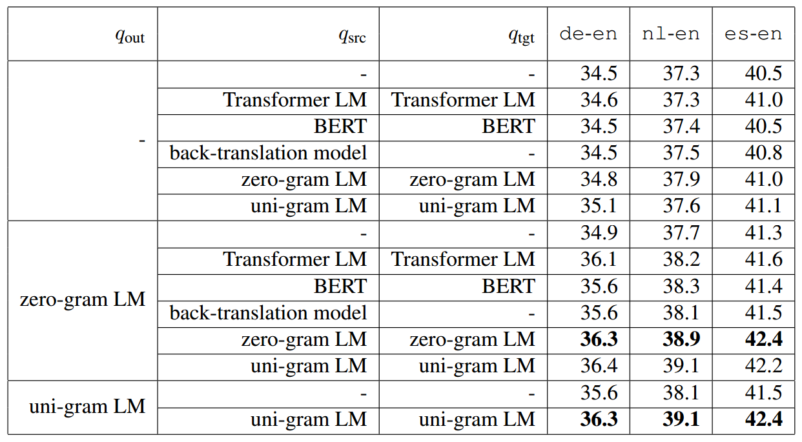
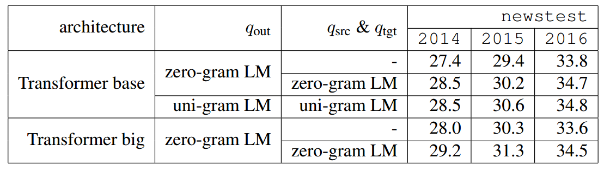

# Introduction
This repository contains the code used for "Unifying Input and Output Smoothing in Neural Machine Translation" (COLING2020). Our code is based on
[fairseq](https://github.com/pytorch/fairseq) and [SCA](https://github.com/teslacool/SCA).

### Architecture
  + q_{src}, q_{tgt}: Input smoothing
  + q_{out}: Output/target smoothing
  + Φ: The parameter to control smoothing weight and sampling method
  + m: Smoothing weight
  <div align=center>
   <br/>
  
  </div>
  
# Requirements and Installation
* PyTorch version >= 1.5.0
* Python version >= 3.6
* **To install fairseq** and develop locally:

``` bash
git clone https://github.com/BaohaoLiao/unify_smoothing.git
cd unify_smoothing
pip install --editable ./
```

* **For faster training** install NVIDIA's [apex](https://github.com/NVIDIA/apex) library.

# Getting Started
### Data Preprocessing
Following the standard fairseq data preprocessing, you can obtain binary translation dataset. For example:
  * IWSLT14 German to English
```
# Download and prepare the data
cd examples/translation/
bash prepare-iwslt14.sh
cd ../..

# Preprocess/binarize the data
TEXT=examples/translation/iwslt14.tokenized.de-en
fairseq-preprocess --source-lang de --target-lang en \
    --trainpref $TEXT/train --validpref $TEXT/valid --testpref $TEXT/test \
    --destdir data-bin/iwslt14.tokenized.de-en \
    --workers 20
```
  * WMT14 English to German
```
  # Download and prepare the data
cd examples/translation/
# WMT'17 data:
bash prepare-wmt14en2de.sh
# or to use WMT'14 data:
# bash prepare-wmt14en2de.sh --icml17
cd ../..

# Binarize the dataset
TEXT=examples/translation/wmt17_en_de
fairseq-preprocess \
    --source-lang en --target-lang de \
    --trainpref $TEXT/train --validpref $TEXT/valid --testpref $TEXT/test \
    --destdir data-bin/wmt17_en_de --thresholdtgt 0 --thresholdsrc 0 \
    --workers 20
  ```

### Training
There are some new flags:
```
parser.add_argument('--srcda', action='store_true', default=False,
                     help='data augmentation in the source side')
parser.add_argument('--srcda-choice', choices=['uniform', 'unigram', 'lm', 'nmt', 'bert'], default=None)
parser.add_argument('--srcda-file', type=str, default='checkpoint_src.pt',
                     help='load pretrained model for data augmentation, no need for uniform and unigram')
parser.add_argument('--srcda-percentage', type=float, default=0,
                     help='how many ratio tokens need to be replaced in source side')
parser.add_argument('--srcda-smooth', type=float, default=0.1,
                     help='how many mass need to be assigned to augmentation distribution in source side')
parser.add_argument('--tgtda', action='store_true', default=False,
                     help = 'data augmentation in the target side')
parser.add_argument('--tgtda-choice', choices=['uniform', 'unigram', 'lm', 'bert'], default=None)
parser.add_argument('--tgtda-file', type=str, default='checkpoint_tgt.pt',
                     help='load pretrained model for data augmentation, no need for uniform and unigram')
parser.add_argument('--tgtda-percentage', type=float, default=0,
                     help='how many ratio tokens need to be replaced in target side')
parser.add_argument('--tgtda-smooth', type=float, default=0.1,
                     help='how many mass need to be assigned to augmentation distribution in target side')
parser.add_argument('--select-choice', choices=['uniform', 'entropy'], default=None,
                     help='how to select the tokens to be replaced')
parser.add_argument('--fix-da-model', action='store_true', default=False)
```
1. **--srcda**: Whether to use input smoothing, i.e. q_{src} and q_{tgt} <br/>
2. **--srcda-choice**: Which smoothing method to apply, could be one of 'uniform', 'unigram', 'lm', 'nmt' and 'bert'. We refer zero-gram LM to uniform in our paper. 'lm' means transformer language model. 'nmt' means applying a whole transformer translation (reverse direction) model as a smoother <br/>
3. **--srcda-file**: Load a pretrained smoother, no need for 'uniform' and 'unigram' <br/>
4. **--srcda-percentage**: The ratio of tokens to be sampled for smoothing <br/>
5. **--srcda-smooth**: Smoothing weight <br/>
6. **--select-choice**: How to sample tokens to be smoothed. Could be one of 'uniform' and 'entropy'. 'uniform' means each token has '--srcda-percentage' probability to be smoothed. 'entropy' means the probability of one token to be smoothed is related to its entropy <br/>
7. **--fix-da-model**: Fix the pretrained smoother <br/>
* **IWSLT14 datasets**: German to English, Dutch to English, Spanish to English
  <div align=center>
   
  </div>
  To reproduce our **best results** on IWSLT14 datasets, i.e. unigram and uniform for all q_{src}, q_{tgt} and q_{out}, you can run the script below on one GPU. You can choose '--srcda-choice' and '--tgtda-choice' to be either 'uniform' or 'unigram'.
```
p=0.2
s=1
checkpoint_path=percentage_$p\_smooth_$s
mkdir $checkpoint_path
python /path/to/unify_smoothing/train.py \
       /path/to/dataset \
       --share-all-embeddings \
       --arch transformer_da_bert_iwslt_de_en \
       --task translation_da \
       --srcda \
       --srcda-percentage $p \
       --srcda-choice uniform \
       --srcda-smooth $s \
       --tgtda \
       --tgtda-percentage $p \
       --tgtda-choice uniform \
       --tgtda-smooth $s \
       --select-choice uniform \
       --optimizer adam \
       --lr 0.0005  -s nl -t en \
       --label-smoothing 0.1 \
       --dropout 0.3 \
       --max-tokens 4096 \
       --min-lr '1e-09' \
       --seed 200 \
       --lr-scheduler inverse_sqrt \
       --weight-decay 0.0001 \
       --criterion label_smoothed_cross_entropy \
       --warmup-updates 4000 \
       --warmup-init-lr '1e-07' \
       --adam-betas '(0.9, 0.98)' \
       --clip-norm 0.0 \
       --keep-last-epochs 5 \
       --patience 10 \
       --save-dir $checkpoint_path \
       --log-format simple \
       > $checkpoint_path/log
```
* **WMT14 English to German** 
  <div align=center>
   
  </div>
  To reproduce our best results on WMT14 English to German, you can run the script below on two GPUs. If you have more available GPUs, you might decrease '--update-freq' for making sure the batch size is above 48000. You can choose '--srcda-choice' and '--tgtda-choice' to be either 'uniform' or 'unigram'. 
```
# This config is used for Transformer base. For Transformer big, please change the following flags:
# --arch transformer_da_vaswani_wmt_en_de_big \
# --lr 0.0005 \
# --max-tokens 2048 \
# --update-freq 15 
p=0.1
s=1
t=0.1
checkpoint_path=percentage_$p\_smooth_$s\_target_$t
mkdir $checkpoint_path
python /path/to/unify_smoothing/train.py \
       /path/to/WMT14En2De \
       --arch transformer_da_wmt_en_de \
       --share-all-embeddings \
       --task translation_da -s en -t de\
       --srcda \
       --srcda-percentage $p \
       --srcda-choice unigram \
       --srcda-smooth $s \
       --tgtda \
       --tgtda-percentage $p \
       --tgtda-choice unigram \
       --tgtda-smooth $s \
       --select-choice uniform \
       --seed 200 \
       --optimizer adam \
       --adam-betas '(0.9, 0.98)' \
       --clip-norm 0.0 \
       --lr-scheduler inverse_sqrt \
       --warmup-init-lr '1e-07' \
       --warmup-updates 4000 \
       --lr 0.0007 \
       --min-lr '1e-09' \
       --criterion label_smoothed_cross_entropy \
       --label-smoothing $t \
       --weight-decay 0.0 \
       --max-tokens 3072 \
       --update-freq 8 \
       --no-progress-bar \
       --log-format simple \
       --log-interval 1000 \
       --keep-last-epochs 5 \
       --patience 10 \
       --save-dir $checkpoint_path \
       > $checkpoint_path/log
```

### Inference
* Use the best checkpoint
```
python  /path/to/unify_smoothing/generate.py \
         /path/to/dataset \
         --path $checkpointpath/checkpoint_best.pt \
         --batch-size 128 \
         --beam 4 \
         --remove-bpe | tee generate.out

grep ^T generate.out | cut -f2- | perl -ple 's{(\S)-(\S)}{$1 ##AT##-##AT## $2}g' > generate.ref
grep ^H generate.out | cut -f3- | perl -ple 's{(\S)-(\S)}{$1 ##AT##-##AT## $2}g' > generate.sys

python /path/to/unify_smoothing/score.py --sys generate.sys --ref generate.ref > log
```
* Average the last five checkpoints
```
python  /path/to/unify_smoothing/scripts/average_checkpoints.py \
       --inputs  $checkpointpath \
       --num-epoch-checkpoints 5 \
       --output average5.pt

python  /path/to/unify_smoothing/generate.py \
         /path/to/dataset \
         --path average5.pt \
         --batch-size 128 \
         --beam 4 \
         --remove-bpe | tee generate.out

grep ^T generate.out | cut -f2- | perl -ple 's{(\S)-(\S)}{$1 ##AT##-##AT## $2}g' > generate.ref
grep ^H generate.out | cut -f3- | perl -ple 's{(\S)-(\S)}{$1 ##AT##-##AT## $2}g' > generate.sys

python /path/to/unify_smoothing/score.py --sys generate.sys --ref generate.ref > log
```

### Ablation Experiments
If you want to reproduce our ablation experiemnts on IWSLT14 datasets, i.e. applying Transformer LM, BERT and back-translation model as smoother, you need to pretrain them first.
* Pretraining Transformer LM or BERT on monolingual data
```
# Split monolingual data from the bilingual data preprocessed before
src=de
tgt=en
for l in $src $tgt; do
    srcdir=${src}2${tgt}
    tgtdir=lmof${l}
    mkdir -p $tgtdir
    cp $srcdir/dict.${l}.txt $tgtdir/dict.txt
    cp $srcdir/train.${src}-${tgt}.${l}.bin $tgtdir/train.bin
    cp $srcdir/train.${src}-${tgt}.${l}.idx $tgtdir/train.idx
    cp $srcdir/valid.${src}-${tgt}.${l}.bin $tgtdir/valid.bin
    cp $srcdir/valid.${src}-${tgt}.${l}.idx $tgtdir/valid.idx
done

# Train Transformer LM on monolingual data on one GPU
python /path/to/unify_smoothing/train.py \
       /path/to/lmofen \  # or /path/to/lmofde \
       --task language_modeling \
       --arch transformer_lm_iwslt \
       --optimizer adam \
       --adam-betas '(0.9, 0.98)' \
       --clip-norm 0.0 \
       --lr-scheduler inverse_sqrt \
       --warmup-init-lr 1e-07 \
       --warmup-updates 4000 \
       --lr 0.0005 \
       --min-lr 1e-09 \
       --dropout 0.3 \
       --weight-decay 0.0 \
       --seed 4 \
       --criterion label_smoothed_cross_entropy \
       --label-smoothing 0.1 \
       --max-tokens 4096  \
       --save-dir $checkpoint_path \
       --no-epoch-checkpoints \
       --patience 10 \
       --log-format simple \
       > log

       
# Train BERT on monolingual data on one GPU
python /path/to/unify_smoothing/train.py \
       /path/to/lmofen \  # or /path/to/lmofde \
       --task masked_lm \
       --arch bert_iwslt_de_en \
       --optimizer adam \
       --adam-betas '(0.9, 0.98)' \
       --clip-norm 0.0 \
       --lr-scheduler inverse_sqrt \
       --warmup-init-lr 1e-07 \
       --warmup-updates 4000 \
       --lr 0.0005 \
       --min-lr 1e-09 \
       --weight-decay 0.0 \
       --criterion masked_lm \
       --max-tokens 4098 \
       --tokens-per-sample 4098 \
       --save-dir $checkpoint_path \
       --no-epoch-checkpoints \
       --log-format simple \
       --patience 10 \
       --seed 200 \
       > log

```
* Pretraining back-translation model <br/>
Same as 'Training', you only need to change the translation direction.

* Processing before loading for training <br/>
You can just load the pretrained Transformer LM or back-translation model by flag '--srcda-file' or '--tgtda-file'. Please also fix the pretrained model by setting '--fix-da-model' and change other corresponding flags, like '--srcda-choice' and '--tgtda-choice'. Then you could apply the same config as 'Trainng'.<br\> 
However, for BERT we have an extra token <MASK> from pretraining. You need to remove the word embedding for <MASK>. To do this, run the script below before loading:
```
python /path/to/unify_smoothing/scripts/cutLastRow.py --path bert/de/checkpoint_best.pt --out checkpoint_src.pt
python /path/to/unify_smoothing/scripts/cutLastRow.py --path bert/en/checkpoint_best.pt --out checkpoint_tgt.pt
```
