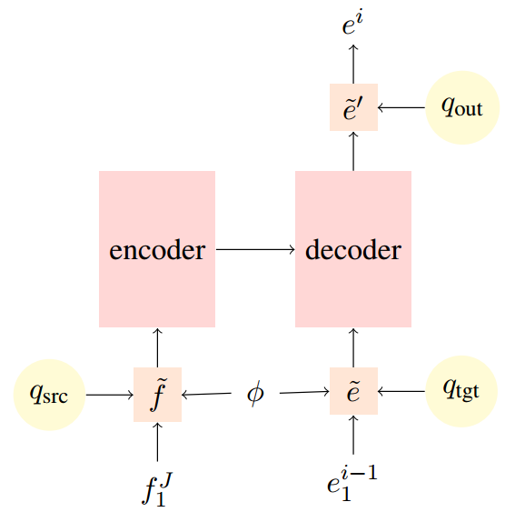
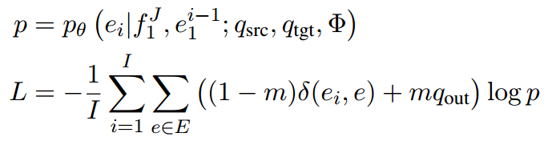

# Introduction
This repository contains the code used for "Unifying Input and Output Smoothing in Neural Machine Translation" (COLING2020). Our code is based on
[fairseq](https://github.com/pytorch/fairseq) and [SCA](https://github.com/teslacool/SCA).

### Architecture
  + q_{src}, q_{tgt}: Input smoothing
  + q_{out}: Output/target smoothing
  + Φ: The parameter to control smoothing weight and sampling method
  + m: Smoothing weight
  <div align=center>
   <br/>
  
  </div>
  
# Requirements and Installation
* PyTorch version >= 1.5.0
* Python version >= 3.6
* **To install fairseq** and develop locally:

``` bash
git clone https://github.com/BaohaoLiao/unify_smoothing.git
cd unify_smoothing
pip install --editable ./
```

* **For faster training** install NVIDIA's [apex](https://github.com/NVIDIA/apex) library.

# Getting Started
### Data Preprocessing
Following the standard fairseq data preprocessing, you can obtain binary translation dataset. For example:
  * IWSLT14 German to English
```
# Download and prepare the data
cd examples/translation/
bash prepare-iwslt14.sh
cd ../..

# Preprocess/binarize the data
TEXT=examples/translation/iwslt14.tokenized.de-en
fairseq-preprocess --source-lang de --target-lang en \
    --trainpref $TEXT/train --validpref $TEXT/valid --testpref $TEXT/test \
    --destdir data-bin/iwslt14.tokenized.de-en \
    --workers 20
```
  * WMT14 English to German
```
  # Download and prepare the data
cd examples/translation/
# WMT'17 data:
bash prepare-wmt14en2de.sh
# or to use WMT'14 data:
# bash prepare-wmt14en2de.sh --icml17
cd ../..

# Binarize the dataset
TEXT=examples/translation/wmt17_en_de
fairseq-preprocess \
    --source-lang en --target-lang de \
    --trainpref $TEXT/train --validpref $TEXT/valid --testpref $TEXT/test \
    --destdir data-bin/wmt17_en_de --thresholdtgt 0 --thresholdsrc 0 \
    --workers 20
  ```

### Training
There are some new flags:
```
parser.add_argument('--srcda', action='store_true', default=False,
                     help='data augmentation in the source side')
parser.add_argument('--srcda-choice', choices=['uniform', 'unigram', 'lm', 'nmt', 'bert'], default=None)
parser.add_argument('--srcda-file', type=str, default='checkpoint_src.pt',
                     help='load pretrained model for data augmentation, no need for uniform and unigram')
parser.add_argument('--srcda-percentage', type=float, default=0,
                     help='how many ratio tokens need to be replaced in source side')
parser.add_argument('--srcda-smooth', type=float, default=0.1,
                     help='how many mass need to be assigned to augmentation distribution in source side')
parser.add_argument('--tgtda', action='store_true', default=False,
                     help = 'data augmentation in the target side')
parser.add_argument('--tgtda-choice', choices=['uniform', 'unigram', 'lm', 'bert'], default=None)
parser.add_argument('--tgtda-file', type=str, default='checkpoint_tgt.pt',
                     help='load pretrained model for data augmentation, no need for uniform and unigram')
parser.add_argument('--tgtda-percentage', type=float, default=0,
                     help='how many ratio tokens need to be replaced in target side')
parser.add_argument('--tgtda-smooth', type=float, default=0.1,
                     help='how many mass need to be assigned to augmentation distribution in target side')
parser.add_argument('--select-choice', choices=['uniform', 'entropy'], default=None,
                     help='how to select the tokens to be replaced')
parser.add_argument('--fix-da-model', action='store_true', default=False)
```
1. **--srcda**: Whether to use input smoothing, i.e. q_{src} and q_{tgt} <br/>
2. **--srcda-choice**: Which smoothing method to apply, could be one of 'uniform', 'unigram', 'lm', 'nmt' and 'bert'. We refer zero-gram LM to uniform in our paper. 'lm' means transformer language model. 'nmt' means applying a whole transformer translation (reverse direction) model as a smoother <br/>
3. **--srcda-file**: Load a pretrained smoother, no need for 'uniform' and 'unigram' <br/>
4. **--srcda-percentage**: The ratio of tokens to be sampled for smoothing <br/>
5. **--srcda-smooth**: Smoothing weight <br/>
6. **--select-choice**: How to sample tokens to be smoothed. Could be one of 'uniform' and 'entropy'. 'uniform' means each token has '--srcda-percentage' probability to be smoothed. 'entropy' means the probability of one token to be smoothed is related to its entropy <br/>
7. **--fix-da-model**: Fix the pretrained smoother <br/>
* IWSLT14 datasets: German to English, Dutch to English, Spanish to English
* WMT14 English to German 


